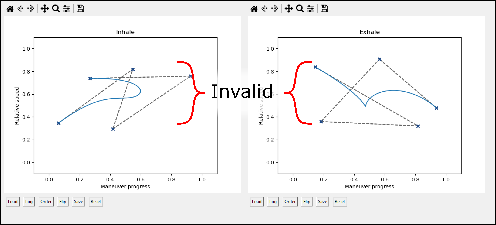
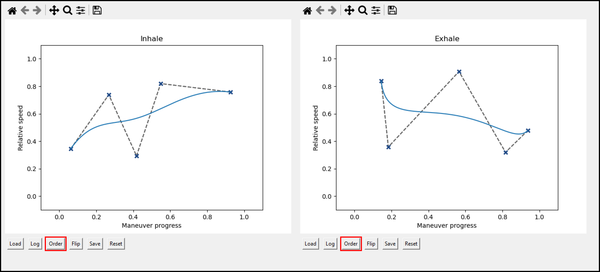
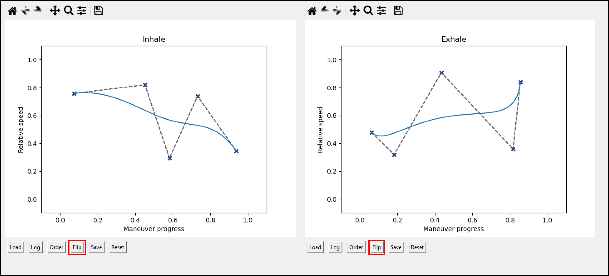

\newpage
# Features

## Overview

The GUI layout consists of three main panels, shown in **Figure \ref{main-overview}**: (1) the sidebar, (2) the main window, and (3) the log window. The sidebar and log window can be expanded by click-and-drag interaction with the sash, and the panels in the main window can be scrolled through.

## Sidebar

The sidebar (**\ref{main-overview}-1**) is the primary site for interaction at the start and end of a run. It is used to save or load overall settings, manage hardware connections, and record notes about a run. It also includes a helpful reminder on what to do for a basic run protocol.

## Log window

The log window (**\ref{main-overview}-3**) displays relevant console output and logging information. Check the contents of this window to confirm the results of any commands. All of the content in this window is also sent to a log file in each run folder. Any actions logged outside of a run will be sent to a generic folder in the GUI folder.

## Main window

The main window (**\ref{main-overview}-2**) is where you will control the system by setting breathing parameters, positioning motors, and interacting with the flow meter and data. You can access different functions through the tabs at the top of the main window.

### Maneuver panel

**Figure \ref{main-maneuver}** shows the maneuver tab. Entry widgets indicate input parameters that can be set interactively. Button widgets indicate actions that you can perform -- either sending or receiving information between the computer and the controller.

### Flow meter panel

**Figure \ref{main-flow}** shows the flow meter tab. Using a TSI 4000 series or Copley DFM 2000 series digital flow meter, you can record data in real time, saving it for future analysis or live viewing. This panel was designed to also record information about the logging conditions, which are saved in an individual flow low file, separate from the main log. 

Logged parameters include device ID, alignment, ambient temperature, relative humidity, and notes about the run. Note that all of these parameters must be manually entered, but they can be updated after starting a flow recording.

### Control curve panel

**Figure \ref{main-curve}** shows an example control curve tab. The layout of the control curve tabs is the same for every lobe, but the information is preserved between each lobe tab (RU, RM, RL, LU, LL).

Each control curve tab includes a brief reminder of how to interact with the interface. There are two graphs, one for inhalation maneuvers, and one for exhalation maneuvers, for which you can interactively define a Bezier curve through click-and-drag actions with the mouse. Additional tuning can be achieved with the buttons along the bottom of each plot, which allow you to load, log, order, flip, save, or reset the control points for each respective plot.

\newpage

# Workflows

The following sections describe a set of workflows/recipes for using the GUI to control the system. They assume that the physical system is appropriately set up, powered on, and connected. That includes, but is not limited to:

- Motor wiring
- Lung model and lobe positioning
- Controller connection to drivers and computer
- Flow meter connection to computer

## Setup

**Figure \ref{setup-1}** shows the process of setting up a run.

1. Set the log folder, if desired, and insert a short description for the run. Click the `Initialize` button. 
    - After initializing the run, the run ID will be logged, and the button text will change to `Clear`.
    - Set any relevant notes about the run. These will be recorded when the run is cleared, so they can be updated at any time during the run.
1. (Optional) Load a configuration to set the global settings, delays, and control points. This will only load files with the `.tidal` extension.
    - The path to the configuration file will be logged for future reference.
1. Enter the names of the serial communication ports for both the flow meter and motor controller, and connect to each device. 
    - This initializes a serial communication but does not routinely evaluate the physical connection by USB. At any point during operation, the button text may report "Connect" or "Disconnect" but differ from the true connection state.
    - On a Windows system, these look like `COM5`, while on a Linux system, they may be `/dev/ttyUSB0` or `/dev/ttyACM1`, where the number can vary. These are easily identified through the VS Code serial extension but can be determined by a variety of other means.

\newpage

## Lobe positioning

**Figure \ref{positioning-1}** shows the process of tuning a lobe position via the GUI. Typically, the gears are first set to a standard "home" position when the motors are powered off. This function can be used to set the status of each lobe before performing a run or while testing functionality.

1. Ensure that the motor controller serial connection is established.
    - If you are unsure, you can toggle the button, and the log information will be displayed in the window.
1. Select which lobe(s) to move by checking any of the boxes.
1. Enter a value for the number of steps to run the maneuver. 
    - This is not a distance value but correlates to a physical distance by the parameters of the gearing, stepper motor, and stepper driver.
1. Click the `Inhale` or `Exhale` button to move the selected motors. 
    - The communication commands will be displayed in the log window.

\newpage

## Setting a variable-delay curve

Variable-delay maneuvers are controlled by setting a Bezier curve to indicate the relative speed of the motor during a maneuver. This enables a virtually arbitrary curve to be created by a small number of simple inputs -- an alternative to generating a profile from a function.

**Figure \ref{curve-1}** shows the process of setting a curve to control the relative speed of a motor during inhalation or exhalation. Each panel layout is identical for every lobe, but the curves for inhalation and exhalation maneuvers are unique for each lobe. Importantly, the configuration is set in these tabs, but it is not transferred to the motor controller or maneuver until it is pushed by the user in the "Maneuver" tab.

1. Click within a plot to add a control point. The resulting curve is generated by interpolating between all of the control points
    - Add at least two points to define a line.
    - Click and drag on a point to adjust its position.
1. Use the buttons at the bottom of the plot to load, save, modify, or view information about the control points.
    - The curve shown for inhalation is the result of adding four control points (1a, 1b, 1c, 1d) to the plot. The coordinates of these points are printed in the log window.
1. Refine the shape of the curve by adding more points. A region can be made sharper by adding repeated points in the same location or proximity, as highlighted by the red box in **Figure \ref{curve-1}**.

**Usage notes:**

- Save or load control points with the `.cp` extension.
- Use the designated keyboard shortcuts after clicking inside one of the plot areas.
    - Click outside of the coordinate bounds to avoid unintentionally adding a control point.
    - (t) toggles control point visibility.
    - (i) inserts a control point at the location of the mouse cursor.
    - (d) deletes the control point at the location of the mouse cursor.
- The x-axis corresponds to the maneuver progress -- meaning 0 is the start of the maneuver, and 1 is the end of the maneuver. This does not correspond to the position of the motor or lobe.
- The horizontal scale is remapped to the x bounds of the control points for calculating the delay at each step in a maneuver. It is not necessary to have a value at exactly 0 or exactly 1.
- The vertical scale is remapped to the bounds supplied in the "Variable-delay Settings" section of the "Maneuver" tab.
    - Setting identical values for the min and max will render the "curve" ineffective, producing a constant-delay profile. This can be used to mix constant and variable maneuvers.
- The delays supplied in the maneuver tab are inversely proportional to the relative speed indicated in the curve plots. A relative speed value of 0 corresponds to the _maximum_ delay, and a relative speed value of 1 corresponds to the _minimum_ delay.

### Valid curves

For a control curve to be valid, it must map one input value to one output value. Simply, the curve cannot cross itself or intersect at more than one point in a sweep from x = 0 to x = 1. An example of invalid inputs is supplied in the source files and shown in **Figure \ref{curve-invalid}.**.

### Order points

The examples of the invalid curves can be made valid by using the `Order` button to arrange the control points along the x-axis. **Figure \ref{curve-order}** shows the result of ordering the control points shown in **Figure \ref{curve-invalid}**. This function can also clean up a list of control points if you are trying to sharpen a curve by clicking on a given point, instead of using the (i) key.

### Flip points

To achieve a position-based symmetry in inhalation and exhalation, use the `Flip` button. This re-orders control points from left to right. The control points in **Figure \ref{curve-order}** are shown flipped in **Figure \ref{curve-flip}**.

\newpage

## Running a breathing profile

Breathing maneuvers are at the core of the TIDAL dynamic lung system. In this context, the term _breathing profile_ will refer to a repeated set of inhalation and exhalation _maneuvers_. **Figures \ref{maneuver-setup}-\ref{maneuver-run}** show the process of running a maneuver.

1. Enter a brief description of the run to follow, including any notes (**Figure \ref{maneuver-setup}**).
1. Load a configuration, if available, or set the breathing parameters manually (**Figure \ref{maneuver-setup}**).
    - Connect the flow meter if recording data.
    - Connect the motor controller.
1. Ensure the maneuver and profile parameters are set appropriately, scrolling through the panel as necessary (**Figure \ref{maneuver-push}**).
1. Push the settings to the controller (**Figure \ref{maneuver-push}**).
    - The process of pushing the settings will be shown in the log window. 
    - Pushing a variable-delay profile requires overwriting the entire control program, so additional output will be shown and stored in the log files.
    - If changing any of the global profile settings, it is best to do so after pushing any maneuver delay or step settings.
1. Check the parameters with the button (**Figure \ref{maneuver-run}**). This will report all of the global, lobe, and maneuver parameters. Ensure that all parameters align with the expected values for the demonstration, validation, or delivery experiment.
1. Run the profile (**Figure \ref{maneuver-run}**).
    - A subset of parameters will be shown before the profile begins.

\newpage

## Recording flow data

Data from the flow meter can be streamed either to a live plot or a log file. The results of the live plot report the measured values but not always at the correct _times_, and therefore, they should only be used to evaluate the rough shape of a breathing profile or gauge the flow rate magnitude. To accurately evaluate flow and time data with this program, the flow meter output must be recorded and stored directly.

1. In the flow meter tab, enter information about the device, alignment or orientation, and ambient conditions. Enter any other notes about the run, such as notable configuration differences or conditions that may affect data processing. (**Figure \ref{flow-setup}**)
1. (Optional) To run a live plot, click the `Plot Live` button, and a new window will appear. (**Figure \ref{flow-live}**)
    - This requires interacting with the flow meter in a separate process, so the flow meter will be disconnected and reconnected automatically.
    - The data from the live plot is not recorded for later analysis.
    - To end the live plot, click the `Terminate` button or close the plot window. (**Figure \ref{flow-live}a**)
1. To start recording data, click the `Start Recording` button. (**Figure \ref{flow-save}**)
    - You can confirm the data collection is successful by checking the run folder for data logged as `.csv` files at an interval of roughly 10 seconds.
    - The flow log information will appear in the log window.
1. Run the maneuver from the "Maneuver" tab. (**Figure \ref{maneuver-run}, \ref{flow-save}**)
1. Once the maneuver is complete or data no longer needs to be collected, end the recording process by clicking the `Terminate` button. (**Figure \ref{flow-save}**)
    - The program will pause while the remaining data are collected.

\newpage

## Analyzing breath/flow data

To increase the throughput of parameter tuning, you can analyze data recorded from the flow meter directly at the system. This is a cursory interactive process that records information to the log file, in addition to displaying on screen. The logged data is saved in a format compatible with further analysis in any process that supports JSON input.

1. From the flow meter tab, click the `Data Folder` button and navigate to the data folder for the run of interest. (**Figure \ref{flowa-setup}**)
    - Note: there will be no files visible in the folder under the file browser view.
1. Click the `Make Interactive Plot` button and wait for the process to begin. (**Figure \ref{flowa-interactive}**)
    - A browser window should automatically open and navigate to the interactive plot.
1. In the interactive plot, hover over any point to display the time point in seconds and the flow rate in the units of the flow meter (typically standard liters per minute, SLPM). (**Figure \ref{flowa-hover}**). Use the plot controls to zoom, pan, or save a screenshot of the plot.
1. Use the selection tools to highlight a region of interest. By using the rectangle selection tool, you can select an entire y-range by clicking and dragging only left or right. (**Figure \ref{flowa-select}**).
    - The following are calculated for the selection: total time (s), volume (standard liters, integrated), peak flow rate, average flow rate, median flow rate.
    - After each selection, the selection information and calculation will be saved to the run log file.
1. When finished with the interactive analysis process, close the browser window and stop the plot server. (**Figure \ref{flowa-stop}**)

\newpage

## Ending a run

It is important to end or clear a run to complete the logging process. **Figure \ref{clear-1}** shows the process of clearing a run. 

1. Complete the notes section with any additional information since running maneuvers, processing output, or concluding the experiment.
1. Click the `Clear` button
    - The run notes will be shown in the log window and recorded to the run log.
    - The configuration will be saved to a `.tidal` file in the run folder.
    - The button text will change back to `Initialize`, and save locations reset to default.

